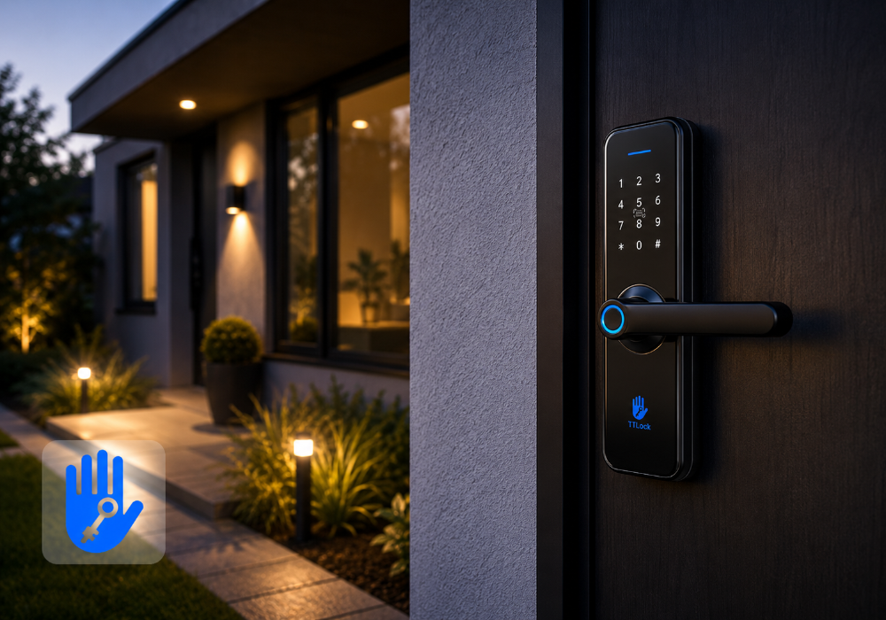

# TTLock for Homey

Control your [TTLock](https://www.ttlock.com/) smart locks straight from Homey. Lock and unlock
your door, keep an eye on the battery level, and bring your existing TTLock locks into your Homey
flows — no extra hardware, no hub, just your existing TTLock account.

## Features

- 🔒 **Lock & unlock** your TTLock door locks from the Homey app, Homey flows, or voice assistants
  connected to Homey.
- ⚡ **Near-instant updates** via a webhook, instead of waiting for the next poll — see who last
  locked/unlocked the door and why, moments after it happens.
- 🔋 **Battery monitoring**, so you always know when it's time to change the batteries.
- 📶 **Gateway signal strength**, so you can spot a lock that's drifting out of range.
- 🚪 **Door sensor** support (open/closed), for locks that have one.
- 🔁 **Auto Lock** and **Lock Sound** toggles, and a read-only **Passage Mode** indicator.
- 👪 **Uses your own TTLock account** — no extra app. If it works in the TTLock app, it'll show up
  here.
- ☁️ Works over the cloud via the official TTLock API, the same connection used by TTLock's own
  app, so there's nothing extra to install on your TTLock hardware.

## Creating a TTLock OAuth app

TTLock requires every app that talks to their cloud API to have its own registered OAuth
application — this one isn't shared between users, so you'll need to create your own once (the
same requirement applies to [hass-ttlock](https://github.com/jbergler/hass-ttlock), the equivalent
Home Assistant integration, if you've set that up before):

1. Go to [open.ttlock.com/manager](https://open.ttlock.com/manager) and create an account.
2. Register an application. This takes a few days to get approved by TTLock.
3. Once approved, note down its **Client ID** and **Client Secret**.

## Getting started

1. Install **TTLock** from the [Homey App Store](https://homey.app).
2. Open the app's Settings in Homey and enter the Client ID/Secret from the previous section.
3. In the Homey app, add a new device and choose **TTLock**.
4. Log in with your TTLock account — the same username and password you use in the TTLock mobile
   app.
5. Pick the lock(s) you want to add and finish the pairing wizard. That's it — your locks are now
   ready to use in Homey, including in flows.

**Requirements:** a TTLock smart lock connected to a TTLock Gateway (Wi-Fi or Ethernet), a TTLock
account with that lock already added in the TTLock app, and your own TTLock OAuth app (see above).

## Getting near-instant updates (optional)

By default the app polls TTLock every 5 minutes, so lock state, battery, and other settings can
take a few minutes to show up in Homey. For near-instant updates instead, wire up TTLock's webhook:

1. Open the app's Settings in Homey — under "Real-time updates" you'll find your webhook URL.
2. Go back to [open.ttlock.com/manager](https://open.ttlock.com/manager), open your application,
   and paste that URL into its callback URL field.
3. Lock or unlock the door (from the TTLock app, a keypad, fingerprint, etc.) and the lock's state,
   "Last Operator", and "Last Trigger" should update in Homey within a couple of seconds.

Without this step everything still works, just on the slower 5-minute poll.

## Getting help

Found a bug or have a feature request? Please open an issue on the
[GitHub issue tracker](https://github.com/briis/ttlock-homey/issues).

## Want to contribute or build this app yourself?

See [DEVELOPMENT.md](DEVELOPMENT.md) for setup, project structure, and the publishing workflow.

## Privacy

See [PRIVACY.md](PRIVACY.md) for what this app stores and sends, and to whom.

## License

[MIT](LICENSE)
